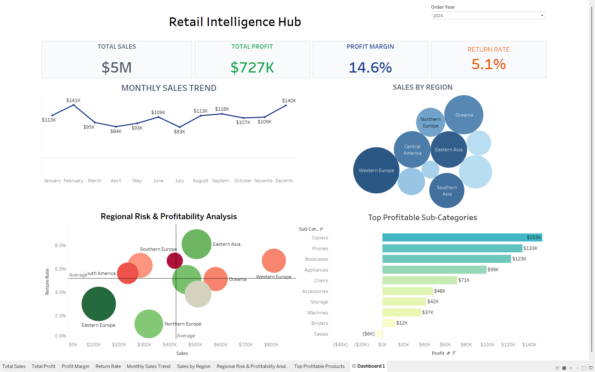

# Retail Intelligence Hub

## Project Overview

Retail Intelligence Hub is an interactive Business Intelligence dashboard developed using Tableau and MySQL to analyze retail sales performance, profitability, profit margins, product returns, and regional business performance. The dashboard transforms transactional data into actionable insights through KPI-driven analytics and interactive visualizations.

---

## Dashboard Snapshot

---

## Business Objectives

- Analyze overall sales and profit performance
- Monitor profit margins across business operations
- Track monthly sales trends and performance
- Evaluate regional sales and profitability
- Analyze product return rates
- Identify top-performing product sub-categories
- Support data-driven business decision-making

---

## Dashboard Components

### KPI Overview
- Total Sales
- Total Profit
- Profit Margin
- Return Rate

### Monthly Sales Trend
- Monthly sales performance analysis to identify growth patterns and seasonal trends.

### Sales & Profit by Region
- Comparative analysis of regional sales and profit contribution across business locations.

### Regional Profitability & Return Rate Analysis
- Evaluation of regional performance using sales, profit margin, and return rate metrics to identify high-performing and improvement areas.

### Top Profitable Sub-Categories
- Analysis of sub-categories based on profit contribution and sales performance to identify key revenue drivers.

---

## Tools & Technologies

- Tableau
- MySQL
- SQL Querying
- Business Intelligence
- Data Visualization

---

## Key Skills Demonstrated

- SQL Querying
- Data Analysis
- Data Visualization
- Dashboard Development
- KPI Analysis
- Business Intelligence Reporting
- Analytical Thinking

---

## Author

**Eha Patil**

B.E. Computer Science Engineering (AI & ML)
